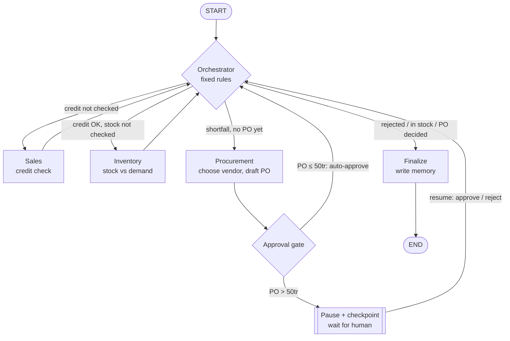
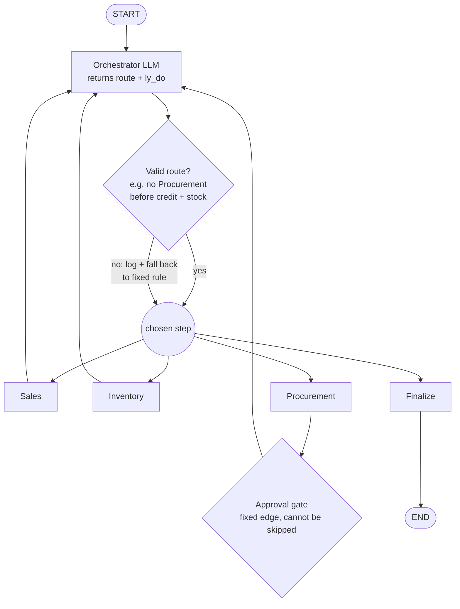

# Sova Agent Demo

A runnable LangGraph demo of the Sova (BES) enterprise-agent architecture: four
agents (Orchestrator, Sales, Inventory, Procurement) fulfill a B2B purchase order
in a Vietnamese distribution setting (VND, hóa đơn GTGT, công nợ). It shows
three things working together: **delegation** between governed agents,
**durable checkpoints** (pause for human approval, survive a restart, resume),
and **cross-run memory** (what one order learns, the next order uses).

---

## 1. Setup

Requires Python 3.10+ (tested on 3.13) and an Anthropic API key.

```bash
git clone https://github.com/thubpham/sova-demo.git && cd sova-demo
uv venv .venv && source .venv/bin/activate      # or: python3 -m venv .venv && source .venv/bin/activate
uv pip install -r requirements.txt              # or: pip install -r requirements.txt
cp .env.example .env                            # then put your key in .env
```

Try it (three separate commands, so run 2 resumes after a real restart):

```bash
python run.py run1 --reset    # place the order → pauses for approval
python run.py run2            # new process: resume from checkpoint → approve → write memory
python run.py run3            # new order → Procurement recalls run 1 from memory
```

Add `--router llm` to any command to let the LLM choose the steps.

---

## 2. Scenarios

| Scenario | Order | What it exercises |
|---|---|---|
| **Run 1 / 2** (main) | KH-001 × 500 SP-123 | Credit OK (1.75 tỷ vs 2.2 tỷ headroom). Stock 200 → **shortfall 300**. PO NCC-001 = **840tr > 50tr → approval pause** |
| **Run 3** (memory) | KH-001 × 80 SP-456 | Shortfall 30, PO ~36tr → **auto-approved**. NCC-003 is cheaper and faster; memory of run 1 supports NCC-001 |
| Reject | KH-003 × 5 SP-789 | 41tr vs 20tr headroom → **credit rejected**, flow skips to finalize |
| In stock | KH-002 × 300 SP-101 | Stock 2000 → **no shortfall**, Procurement skipped |
| Compare | KH-002 × 70 SP-456 | Same order through both routers → step sequence should match |

Built-in traps: NCC-002 is always the cheapest but has **no hóa đơn GTGT**, so
Procurement's constraints should rule it out.

---

## 3. Commands

| Command | What it does | What it proves |
|---|---|---|
| `run1` | Places the main order; stops at the approval gate and prints the interrupt payload | Delegation + approval gate |
| `run2` | Loads the checkpoint, resumes with an approval decision, prints the memory written | Checkpoint durability |
| `run3` | Shows the past decisions memory holds for KH-001, then runs a new order | Cross-run memory |
| `reject` | Customer over credit limit | Routing skips steps |
| `instock` | Order fully in stock | Routing skips Procurement |
| `compare` | Same order under `fixed` and `llm` routers, side by side | LLM routing matches the rules |
| `all` | Reset, then run1 → run2 → run3 → reject in one process (run 2 uses a fresh graph instance) | Full demo in one go |
| `reset` | Rebuild ERP from `mock_data.json`, wipe checkpoints, reseed memory | Clean slate |

| Flag | Default | Meaning |
|---|---|---|
| `--router fixed\|llm` | `fixed` | Who picks the next step: code rules or the Orchestrator LLM |
| `--reset` | off | Reset before running |
| `--decision approve\|reject` | `approve` | Approval decision for `run2` |
| `--approver`, `--note` | Procurement owner, default note | Recorded in the approval and in memory |

Tips: `run1` refuses to re-run an order that already has a checkpoint (use
`--reset`). Run `compare --reset` for a clean comparison. Inspect data directly
with `sqlite3 erp.sqlite "select * from purchase_orders"`.

---

## 4. Configuration

All agent config lives in `identities.json` (editable without code changes).

| Agent | Model | Why |
|---|---|---|
| Orchestrator | `claude-sonnet-5-5` | Routing judgment (`--router llm`) |
| Procurement | `claude-sonnet-5-5` | Vendor trade-offs, memory use |
| Sales | `claude-haiku-4-5` | Tool lookups + a fixed result; cheaper, faster |
| Inventory | `claude-haiku-4-5` | Same; result is also checked against the ERP in code |

- **Temperature:** not set. Sonnet 5.5 rejects non-default values; Haiku kept the same for now.
- **Thinking:** not set. Sonnet 5.5 thinks adaptively by default; Haiku 4.5 runs without thinking.
- **Structured output:** native (`ProviderStrategy`). Forced tool calls (`ToolStrategy`) are rejected by Sonnet 5.5.
- **Governance fields:** `scoped_tools` (the only tools an agent can call), `memory_namespaces` (read/write permissions), `approval_threshold_vnd` (50tr on Procurement), `owner`, `max_iter`.

---

## 5. Architecture

### Components: four stores, kept distinct

| Store | Holds | Lifetime | Tech / file |
|---|---|---|---|
| **Shared state** | This run's working data (checks, draft PO, approvals, audit) | One run | `PurchaseState` in `state.py` |
| **Checkpoint** | Snapshot of state after every step; one order = one `thread_id` (`don-hang:{order_id}`) | Until deleted | `SqliteSaver` → `sova_demo.sqlite` |
| **Long-term memory** | What we've learned: vendor reliability, customer preferences, past decisions | Permanent | `SqliteStore` → `sova_demo.sqlite` (`memory.py`) |
| **Business data (ERP)** | What's true now: price, stock, credit | Source of truth | `mock_data.json` seed → `erp.sqlite` (`erp.py`) |

Plus two layers on top:

| Layer | Role | File |
|---|---|---|
| **Identity registry** | Each agent's role, goal, model, tools and permissions as config | `identities.json` |
| **Tools** | Six thin ERP wrappers, each available only to the agent that lists it | `tools.py` |

**Rules that keep them apart:** ERP = "what's true now", memory = "what we've
learned"; ERP data is never copied into memory. Checkpoint = "resume this exact
run"; memory = "carry learning into the next, unrelated run".

**How an agent gets context:** the system prompt is built from its registry
record. Each run, the node code builds the task message: its permitted memory
(first), the order, earlier results, then the task. Agents read memory but never
write it; only `finalize` writes, under the owning agent's permissions.

### Flow: fixed router (deterministic)

Every worker returns to the Orchestrator, which picks the next step with code
rules.



### Flow: LLM router

Same graph. The Orchestrator LLM picks the route and gives a reason; code checks
the choice before it runs.



**Enforced in code under both routers:** Procurement always goes through the
approval gate; Finalize refuses an unapproved PO; PO amounts and the approval
decision come from the ERP and registry, never from the LLM; Inventory's result
is corrected from the ERP if it disagrees; the loop stops after the
Orchestrator's `max_iter` (12).

---

## Notes

- **Swapping in the real Sova ERP:** each tool in `tools.py` makes a single
  `erp.query(...)` or `erp.transaction()` call; replace that call per tool.
- **Production, not demo:** SQLite → Postgres (`PostgresSaver`) for concurrent
  orders; per-agent message scoping as workflows grow; TTL or compaction for the
  `quyet_dinh` decision log, the only memory that grows per order.
