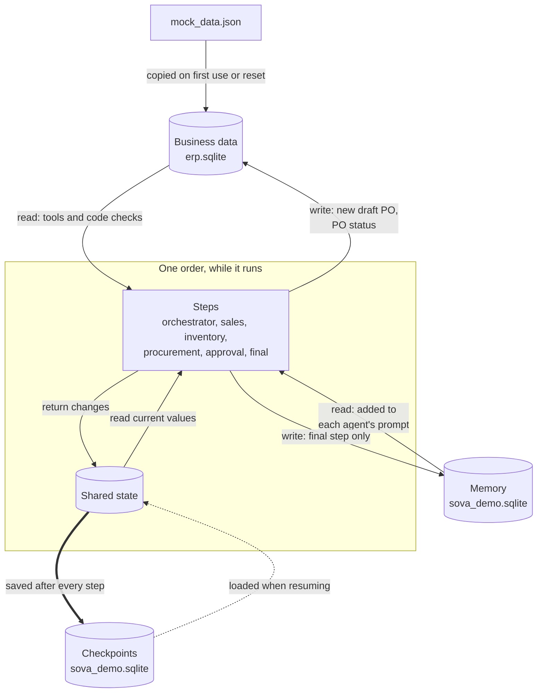
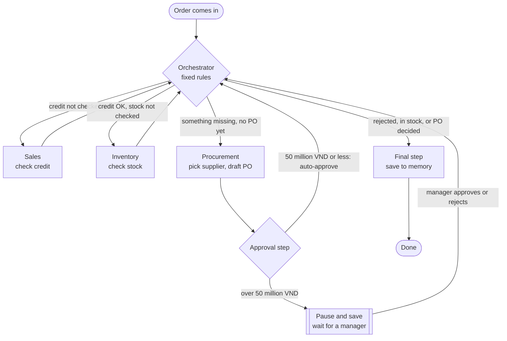
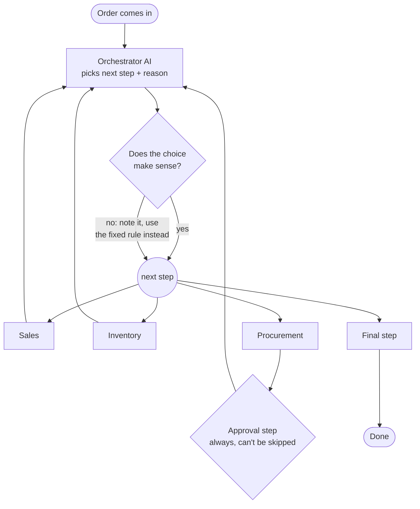

# Sova Agent Demo

A small team of AI agents that handles a customer's purchase order, the way a
company's staff would. The setting is a Vietnamese business-to-business (B2B)
distributor: prices are in Vietnamese đồng (VND), suppliers must issue a VAT
invoice (hóa đơn giá trị gia tăng, "hóa đơn GTGT"), and customers buy on credit
(công nợ).

The demo shows three things:

1. **Teamwork with rules.** Each agent has one job, its own tools, and limits on
   what it may do.
2. **Pause and resume.** Big purchases stop and wait for a manager. The wait
   survives closing the program; it picks up exactly where it left off.
3. **Memory.** What the team learns on one order (for example "this supplier was
   reliable") is used on the next order.

---

## 1. Setup

You need Python 3.10 or newer (tested on 3.13) and an Anthropic API key.

```bash
git clone https://github.com/thubpham/sova-demo.git && cd sova-demo
uv venv .venv && source .venv/bin/activate      # or: python3 -m venv .venv && source .venv/bin/activate
uv pip install -r requirements.txt              # or: pip install -r requirements.txt
cp .env.example .env                            # then paste your API key into .env
```

**Option A: in the browser.** Start the server, then open
<http://localhost:8765>:

```bash
python -m uvicorn api:app --port 8765
```

Pick an order and a router, press **Chạy đơn** (run order), and watch each step
appear. Big orders stop at an approval card where you approve or reject. Other
tabs compare the two routers, show what's saved, list every AI call with its
cost, and show the agents' setup. **Đặt lại demo** (reset) starts over. The API
behind the page is listed at <http://localhost:8765/docs>.

**Option B: in the terminal.** Run these as three separate commands, so step 2
really starts from a closed program:

```bash
python run.py run1 --reset    # start fresh, place an order → it pauses for approval
python run.py run2            # approve it → the order finishes and the team saves what it learned
python run.py run3            # a new order → the team uses what it learned in run 1
python run.py inspect         # look at what was saved
python run.py usage           # every AI call: purpose, tokens, time, cost
```

Add `--router llm` to any command to let the AI decide the order of steps
(see [The agents](#2-the-agents)).

---

## 2. The agents

Think of one manager and three specialists.

| Agent | Role | What it can do |
|---|---|---|
| **Orchestrator** (Điều phối viên) | The manager. Decides who works next and when the order is done. Does no business work itself. | No tools. |
| **Sales** (Kinh doanh) | Checks the customer can pay: is the order within their credit limit? | Look up a customer; check an order against their credit. |
| **Inventory** (Kho) | Checks the warehouse: how many do we have, how many are missing? | Check stock; check the reorder level. |
| **Procurement** (Thu mua) | Buys what's missing: compares suppliers and drafts a purchase order (PO). | Look up supplier prices; create a draft PO. |

How they work together:

- **Everyone reports back to the Orchestrator.** Specialists never hand work to
  each other directly; they finish, and the Orchestrator picks the next step.
- **Two ways to pick the next step.** `--router fixed` (default) uses simple
  code rules, always in the same order. `--router llm` lets the Orchestrator AI
  decide and explain why; code double-checks its choice.
- **Each agent can only use its own tools** and read its own part of memory.
- **Purchases over 50 million VND need a human.** Every draft PO goes through
  an approval step that no agent can skip. Smaller ones are approved
  automatically.
- **A final step (plain code, not an agent)** saves what was learned to memory.

---

## 3. Scenarios

Each scenario is one customer order. Product codes are called SKUs (stock
keeping units), e.g. SP-123. Customers are KH-xxx, suppliers NCC-xxx.

**Run 1 + 2: a big order that needs a manager**
- **Input:** customer KH-001 orders 500 industrial pumps (SP-123).
- **Expected:** credit is fine. The warehouse has only 200, so 300 are missing.
  Procurement buys 300 from supplier NCC-001 for 840 million VND. That's over
  the 50 million limit, so the order **pauses** for a manager (run 1). Run 2
  approves it in a new program session, and the order finishes.
- **Tests:** the approval pause, and resuming after the program was closed.

**Run 3: the team remembers**
- **Input:** the same customer orders 80 valves (SP-456), a different product.
- **Expected:** 30 are missing. Supplier NCC-003 is a bit cheaper and faster,
  but memory says the team chose NCC-001 in run 1 and it was reliable.
  Procurement picks NCC-001 and mentions run 1's order. The purchase is 36
  million VND, under the limit, so it's approved automatically.
- **Tests:** memory carrying over from one order to the next.

**Reject: customer over their credit limit**
- **Input:** customer KH-003 orders 5 control panels (SP-789), worth 41 million VND.
- **Expected:** KH-003 only has 20 million VND of credit left. Sales says no,
  and the order goes straight to the end; no stock check, no purchase.
- **Tests:** the team skipping steps that make no sense.

**In stock: nothing to buy**
- **Input:** customer KH-002 orders 300 steel pipes (SP-101).
- **Expected:** the warehouse has 2,000. Nothing is missing, so Procurement is
  skipped.
- **Tests:** skipping Procurement when it isn't needed.

**Compare: code rules vs. AI**
- **Input:** customer KH-002 orders 70 valves (SP-456), run twice: once with
  `--router fixed`, once with `--router llm`.
- **Expected:** both take the same steps, and the output says they match.
- **Tests:** the AI manager makes the same sensible choices as the rules.

One trap is built in: supplier NCC-002 is always the cheapest but can't issue a
VAT invoice, so Procurement should never pick it.

---

## 4. Commands

| Command | What it does | What it tests |
|---|---|---|
| `python run.py run1` | Places the big order; stops and shows what's waiting for approval | Approval pause |
| `python run.py run2` | Reopens the paused order, approves it, shows what was saved to memory | Resume after restart |
| `python run.py run3` | Shows what memory knows about the customer, then places a new order | Memory |
| `python run.py reject` | Order from a customer over their credit limit | Skipping steps |
| `python run.py instock` | Order that's fully in stock | Skipping Procurement |
| `python run.py compare` | Same order with code rules and with the AI, side by side | AI vs. rules |
| `python run.py all` | Resets, then runs 1 → 2 → 3 → reject in one go | Everything at once |
| `python run.py inspect` | Prints what's saved: memory and each order's progress (no AI calls) | — |
| `python run.py usage` | Lists every AI call: which agent, why, tokens in and out, seconds, model, estimated cost; then totals per agent, order and model | Cost and speed |
| `python run.py reset` | Starts over: fresh business data, no orders, starter memory | — |

Options:

| Option | Default | Meaning |
|---|---|---|
| `--router fixed\|llm` | `fixed` | Who picks the next step: code rules or the AI |
| `--reset` | off | Start over before running |
| `--decision approve\|reject` | `approve` | The manager's answer in `run2` |
| `--approver`, `--note` | Procurement's manager, a default note | Saved with the approval |
| `--order DH-1001` | — | With `inspect`: print everything saved for that order. With `usage`: show only that order's AI calls |

About `usage`: every AI call is logged to `llm_usage.jsonl` (cleared by `reset`). Each run also prints a one-line total. One AI call is one request to the model; an agent usually makes 2–3 (ask for tools, then answer). Costs are estimates from list prices. Sonnet's output tokens include its thinking.

Tips: `run1` won't re-run an order that's already started; add `--reset`. For a
clean comparison, run `compare --reset`. The business data can be read with
`sqlite3 erp.sqlite "select * from purchase_orders"`.

---

## 5. Configuration

Each agent is described in `identities.json`: its role, goal, model, tools, and
limits. You can change it without touching code.

| Agent | Model | Why |
|---|---|---|
| Orchestrator | `claude-sonnet-5-5` | Needs judgment to choose steps (with `--router llm`) |
| Procurement | `claude-sonnet-5-5` | Needs judgment to weigh suppliers and use memory |
| Sales | `claude-haiku-4-5` | Simple lookups; cheaper and faster |
| Inventory | `claude-haiku-4-5` | Simple lookups; its answer is also double-checked in code |

- **Temperature (randomness):** not set. Sonnet 5.5 doesn't allow changing it;
  Haiku is left the same for now.
- **Thinking:** not set. Sonnet 5.5 thinks before answering by default; Haiku
  4.5 doesn't.
- **Answers come back in a fixed format** (structured output), so the code never
  has to guess what the AI meant.

---

## 6. Architecture

### Where things are kept

| What | Holds | Kept for | Where |
|---|---|---|---|
| **Shared state** | This order's working notes: checks, draft PO, approvals, audit trail | One order | In memory while running (`state.py`) |
| **Checkpoint** | A snapshot of the shared state after every step, so a paused order can resume | Until reset | `sova_demo.sqlite`, tables `checkpoints` + `writes` |
| **Long-term memory** | What the team learned: supplier reliability, customer habits, past decisions | Permanent | `sova_demo.sqlite`, table `store` |
| **Business data** | The facts right now: prices, stock, credit. In a real company this is the ERP (enterprise resource planning) system | Source of truth | `mock_data.json` → copied into `erp.sqlite` |

Two simple rules keep these apart:

- **Business data says what's true now; memory says what we learned.** Prices
  and stock are always looked up fresh, never remembered.
- **Checkpoints resume one order; memory helps the next order.**

**What's inside `sova_demo.sqlite`:**

- **Memory (`store` table):** one readable row per fact. Example:
  `nha_cung_cap / NCC-001 → {"do_tin_cay": 0.9, "uu_tien": 1, ...}`. There are
  three groups: suppliers (`nha_cung_cap`), customers (`khach_hang`), and past
  decisions (`quyet_dinh`).
- **Checkpoints (`checkpoints` + `writes` tables):** one row per step per order,
  keyed by `don-hang:<order id>`. The contents are packed (not human-readable);
  use `python run.py inspect --order DH-1001` to unpack them.

**Other files:**

| File | What it is |
|---|---|
| `identities.json` | The agents' job descriptions and permissions |
| `tools.py` | The six tools agents can call (all read or write business data) |
| `graph.py` | The workflow: agents, routing, approval step, final step |
| `run.py` | The demo commands |
| `api.py` | The web server: the browser page talks to the agents through it |
| `ui/` | The browser page (`index.html`, `app.js`); `ui/design/` holds the original design |

### How data moves

Who reads and writes each store. The thick arrow happens after every step.



Step by step for the main order (run 1, then run 2). "Checkpoint" counts the
saved snapshots for this order.

| Step | Checkpoint | Shared state | Memory | Business data |
|---|---|---|---|---|
| Order arrives (`run1`) | #1 | **Created**: order filled in, every result empty | — | — |
| Start | #2 | Hands over to the Orchestrator | — | — |
| Orchestrator | #3 | `route` = sales | — | — |
| Sales | #4 | `sales_check` set | read customers | read customer, product price |
| Orchestrator | #5 | `route` = inventory | — | — |
| Inventory | #6 | `stock_check` set (corrected from business data if the agent disagrees) | read stock notes | read stock (agent tool + code check) |
| Orchestrator | #7 | `route` = procurement | — | — |
| Procurement | #8 | `draft_po` set | read suppliers, customers, past decisions | read prices, **write new draft PO**, read it back |
| Approval: 840 million VND, over the limit | none | **Pause** saved next to #8; the program exits | — | — |
| Resume (`run2`, new program) | loads #8 | State rebuilt; the approval step **starts over** with the manager's answer | — | — |
| Approval (approved) | #9 | `approvals` +1 | — | **write PO status** → approved |
| Orchestrator | #10 | `route` = finalize | — | — |
| Final step | #11 | Order done | **write** customer habits, past decision, supplier score | — |

Every step except "Start" also adds a line to the audit trail.

**When state and checkpoints happen:**

- **Shared state is created once per order**, when the order first comes in. It
  lives in program memory; when the program exits, only the checkpoints remain.
- **Steps never edit state directly.** Each returns only the fields it changed.
  Lists (messages, audit, approvals) grow; everything else is replaced.
- **A full snapshot is saved after every finished step**, plus one for the
  incoming order: 8 in run 1, 3 more in run 2. Nothing is overwritten; old
  snapshots stay until `reset`.
- **A pause saves no new snapshot.** The pause request is saved next to the last
  one. On resume the paused step runs again from its first line, so it only
  changes business data after the pause point.
- **Agents also save their own sub-steps** (every AI reply and tool call), filed
  under the step's name. The raw table has about 25 rows after run 1;
  `run.py inspect` shows only the main ones.
- **One order = one thread** (`don-hang:<order id>`). Memory has no thread: it's
  shared by every order.

### Flow with code rules (`--router fixed`)

Every specialist reports back to the Orchestrator, which follows fixed rules.



### Flow with the AI deciding (`--router llm`)

Same team, same steps. The Orchestrator AI picks the next step and says why;
code checks the choice before it runs.



**Safety rules that hold in both modes:** every PO goes through the approval
step; the order can't finish with an unapproved PO; amounts and limits come
from the business data and config, never from the AI; Inventory's numbers are
re-checked against the business data; the Orchestrator stops after 12 steps.

---

## 7. Future development

This is a demo: it handles one order at a time, on one computer, with fake
business data. Before real use, these areas need work. The first four matter
most.

**1. Many orders at once**
Two orders can currently claim the same stock or the same customer credit.
Real use needs stock and credit to be reserved while an order waits for
approval, business-data writes that are safe to repeat after a crash (no
duplicate purchase orders), and memory updates that don't overwrite each other.

**2. Double-checking the AI**
Some AI answers are already checked in code (stock, purchase amounts); others
aren't yet (the credit decision). Every decision that matters should be
re-checked against business data, and hard rules (VAT invoice required, budget,
minimum order size) should be enforced in code, not just written in prompts.
Numbers shown to people should come from data, not from the AI's wording.

**3. Approvals**
Approvers need to log in and be allowed to approve; whoever requests a purchase
can't approve it. Limits need several levels (department head, then finance)
and must not be dodged by splitting one purchase into small ones. Approvers
need notifications, reminders, and a way to handle rejections.

**4. Data storage and formats**
- **SQLite → Postgres.** SQLite handles one writer at a time. Postgres lets many
  orders and agents run together; LangGraph provides drop-in versions for both
  checkpoints (`PostgresSaver`) and memory (`PostgresStore`).
- **A file space per workspace (virtual file system).** Agents will produce
  files along the way: supplier quotes, draft documents, reports. These belong
  in a per-workspace file space, not in memory or checkpoints. The order's
  state should hold only a link to each file. Each workspace's files need
  access control, cleanup rules, and checks for hidden instructions in uploaded
  files.
- **Readable records for audit and reporting.** Checkpoints are packed and
  can't be searched. Who did what, when, and why should also go into a plain,
  append-only table that can be queried and can't be edited.
- **Planning for change.** An order can wait days for approval. If the code or
  the shape of the saved data changes meanwhile, the saved order must still
  load, so saved data needs a version number and an upgrade path.
- **Memory that scales.** Today each agent gets all of its memory in its prompt.
  With thousands of suppliers it should look up only what's relevant.
- **Cleanup and backups.** Old checkpoints and decision records grow forever and
  need pruning. Memory has no other copy anywhere, so it needs backups.

**5. Security and privacy**
Keep each company's (workspace's) data fully separate. Give each agent its own
limited access to business data. Treat memory as data, never as instructions,
so a malicious note can't steer later orders. Follow Vietnam's personal data
rules (Decree 13/2023) and keep API keys in a secrets manager.

**6. Running it as a service**
Replace the command line with a service: orders arrive from the ERP or a chat,
a queue processes them, and an approval click resumes the order. Add retries and
backup models when the AI or the ERP fails, monitoring, and a spending limit
per order.

**7. Smarter memory and testing**
Supplier scores should improve when a supplier actually delivers on time, not
just when it's chosen, and old information should fade. A fixed set of test
orders should run on every change, so new models or prompts don't silently
change behavior.

**8. Real business scope and the real ERP**
Support orders with several products, partial deliveries, cancellations, VAT
amounts, and e-invoices. To connect the real Sova ERP, each tool in `tools.py`
makes one call to the mock database (`erp.query(...)` or `erp.transaction()`);
replace that one call per tool.
